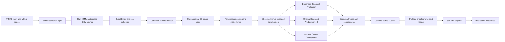
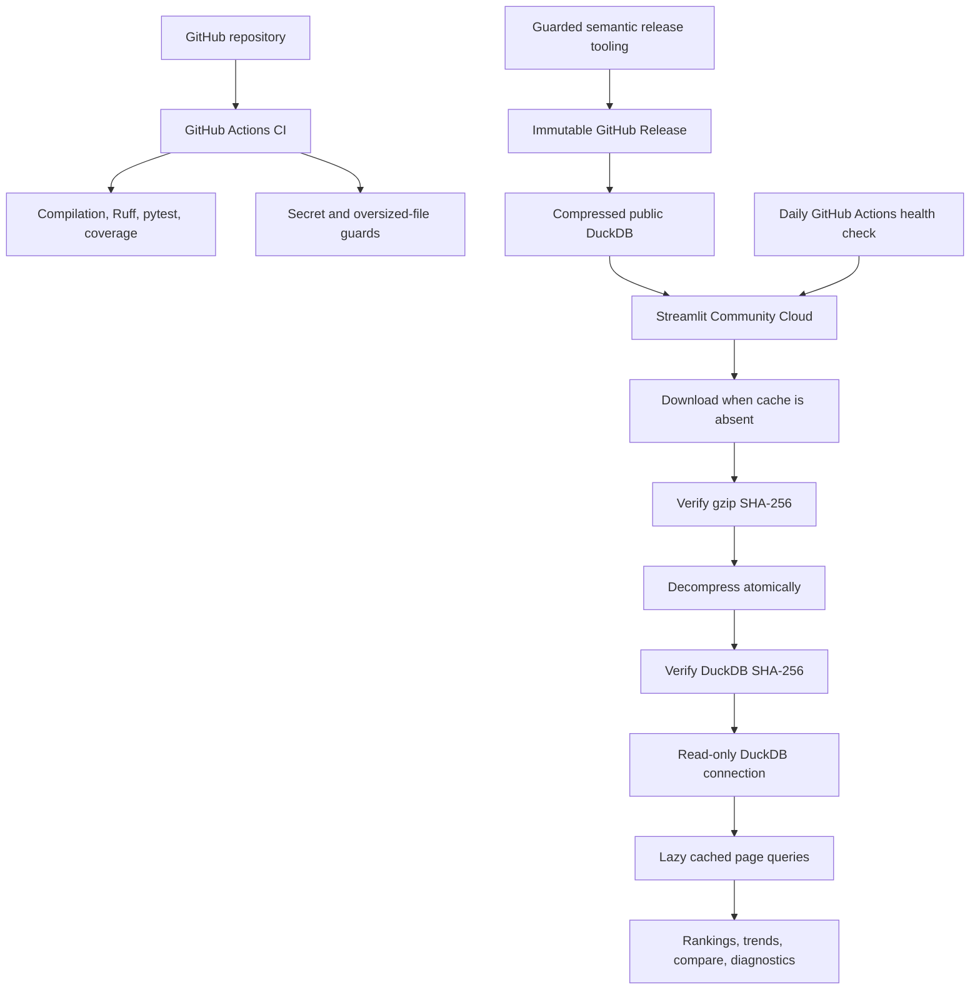
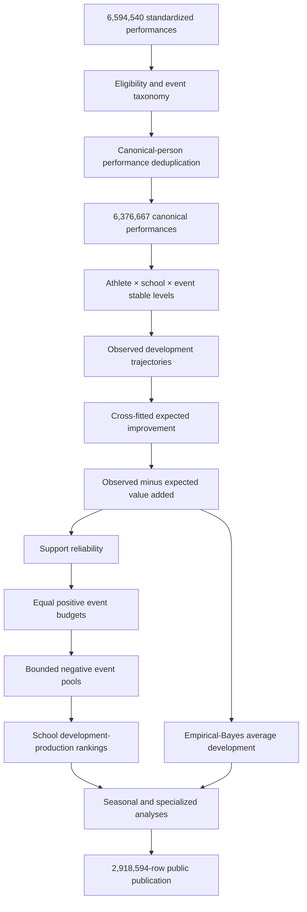

# Architecture and Data Flow

## System architecture

## Deployment architecture

## Analytical data flow

## Primary components

| Layer | Main responsibility | Representative technology |
|---|---|---|
| Collection | Retrieve rosters, profiles, meets, and results | Python, Requests, BeautifulSoup |
| Parsing | Normalize source pages into resumable chunks | Python, Pandas |
| Storage | Maintain relational and analytical data | DuckDB |
| Identity | Resolve people, duplicates, teams, and school stints | SQL, Python |
| Modeling | Estimate observed and expected development | Pandas, NumPy, scikit-learn |
| Publication | Freeze rankings, audits, and metadata | DuckDB, CSV |
| Application | Interactive public exploration | Streamlit, Altair |
| Quality | Test logic, deployment, and documentation contracts | pytest, Ruff, Coverage |
| Operations | CI, health checks, immutable releases | GitHub Actions, GitHub Releases |

## Design principles

1. Preserve source-to-output provenance.
2. Resolve identity and school ownership before modeling.
3. Keep missing data explicit.
4. Separate the official production model from companion views.
5. Treat rankings as observational estimates.
6. Use immutable, checksum-verified deployment artifacts.
7. Test production behavior using safe synthetic fixtures.
8. Prefer dry-run-first release processes.
