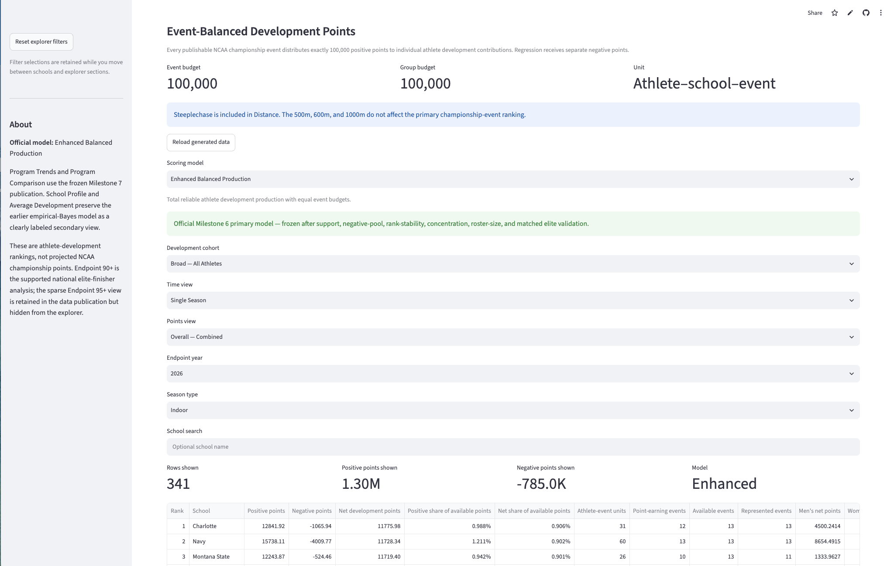
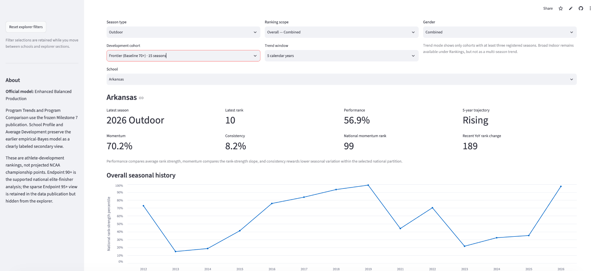

# NCAA Track Analytics Pipeline — Project Documentation

This directory contains the primary project overview, architecture,
implementation notes, application images, and presentation materials.

## Documentation

- [Case study](CASE_STUDY.md)
- [Architecture and data flow](ARCHITECTURE_AND_DATA_FLOW.md)
- [Project summaries and engineering notes](PROJECT_SUMMARIES.md)
- [Demo and recording guide](DEMO_AND_RECORDING_GUIDE.md)

## Project links

- Live explorer:
  https://ncaa-d1-track-analytics-pipeline-explorer.streamlit.app/
- Source repository:
  https://github.com/joeyn256/NCAA-Track-Analytics-Pipeline
- Immutable public deployment:
  https://github.com/joeyn256/NCAA-Track-Analytics-Pipeline/releases/tag/public-deployment-v1

## Model hierarchy

- Official primary model: **Enhanced Balanced Production**
- Balanced-production companion: **Original Balanced Production v4.1**
- Efficiency companion: **Average Athlete Development**

The rankings are observational. They measure development patterns in the
recorded collegiate data and do not establish causal coaching effects.

## Application images

### Official Enhanced Balanced Production ranking

The official view below shows the Broad — All Athletes, Overall — Combined
ranking for the 2026 Indoor season.

### Program trends

The trends view shows a multi-season program trajectory using national
rank-strength percentiles and explicit missing-season handling.

